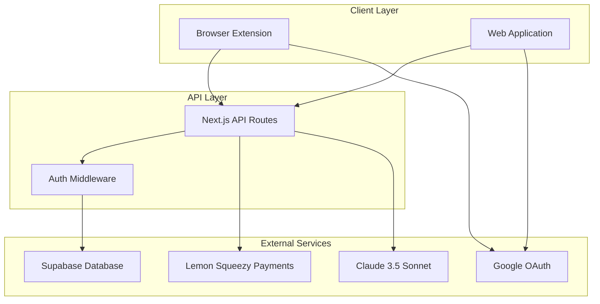

# Design Document

## Overview

The EmotifyAI platform overhaul represents a comprehensive transformation of the existing Verba platform, encompassing complete rebranding, architectural improvements, and feature enhancements. The system maintains its core functionality as an AI-powered text enhancement platform while introducing a new credit-based subscription model, improved user experience, and production-ready infrastructure.

The platform consists of three main components: a browser extension for seamless text enhancement across websites, a Next.js web application for user management and dashboard functionality, and a robust backend API layer. The transformation emphasizes single-domain architecture (emotifyai.com), improved authentication flows with fallback mechanisms, scalable subscription management with lifetime offer tracking, and comprehensive UI/UX improvements including loading states and personalized experiences.

Key transformation areas include:
- Complete rebranding from Verba to EmotifyAI across all touchpoints
- Migration to single-domain architecture using emotifyai.com
- New credit-based subscription model with 6 tiers including limited lifetime offer
- Enhanced user experience with personalized navigation and loading states
- Improved authentication flows with cross-platform token synchronization
- Production-ready infrastructure with proper monitoring and deployment

## Architecture

### High-Level Architecture



### Single Domain Architecture

The platform adopts a unified domain structure using `emotifyai.com`, migrating from the previous multi-subdomain approach:
- Web Application: `https://emotifyai.com`
- API Endpoints: `https://emotifyai.com/api/*`
- Authentication Callbacks: `https://emotifyai.com/auth/callback`
- Payment Callbacks: `https://emotifyai.com/api/webhooks/lemonsqueezy`
- Extension Communication: All extension API calls use `https://emotifyai.com/api`

This architecture simplifies CORS configuration, SSL certificate management, and reduces complexity in external service integrations. The migration requires updating all environment variables, OAuth configurations, webhook endpoints, and DNS settings.

### Component Interaction Flow

1. **Extension Workflow**: User selects text → Extension captures selection → Background script validates auth → API call to `/api/enhance` → AI processing → Response with enhanced text → In-page replacement
2. **Web App Workflow**: User accesses dashboard → Middleware validates session → Component fetches data via hooks → API routes query database → Real-time updates via TanStack Query
3. **Subscription Workflow**: User selects plan → Lemon Squeezy checkout → Webhook updates database → Real-time sync to extension and web app

## Components and Interfaces

### Browser Extension Components

#### Content Script Architecture
```typescript
interface OverlayManager {
  showNotification(message: string, type: 'success' | 'error'): void
  hideNotification(): void
}

interface SelectionManager {
  getSelectedText(): string | null
  validateSelection(): boolean
  replaceText(newText: string): void
  enableUndo(): void
}

interface TextReplacementManager {
  performReplacement(originalText: string, enhancedText: string): Promise<void>
  undoLastReplacement(): void
  trackReplacements(): ReplacementHistory[]
}
```

#### Background Script Services
```typescript
interface AuthService {
  validateToken(): Promise<boolean>
  refreshToken(): Promise<string>
  handleOAuthFlow(): Promise<AuthResult>
  syncTokensAcrossTabs(): Promise<void>
  clearAllTokens(): Promise<void>
}

interface SubscriptionService {
  checkUsageLimit(): Promise<UsageStatus>
  syncSubscriptionData(): Promise<SubscriptionData>
  trackUsage(enhancement: EnhancementLog): Promise<void>
}

interface AIService {
  enhanceText(text: string, options: EnhancementOptions): Promise<EnhancementResult>
  detectLanguage(text: string): Promise<string>
}

// Authentication Fallback Services
interface FallbackAuthService {
  generateEmergencyToken(): Promise<string>
  validateFallbackToken(token: string): Promise<boolean>
  logAuthSyncFailure(error: Error): Promise<void>
  retryAuthSync(maxRetries: number): Promise<boolean>
}

// Token Management
interface TokenManager {
  cacheToken(token: string, storage: 'localStorage' | 'sessionStorage'): void
  getCachedToken(): string | null
  refreshTokenAutomatically(): Promise<string>
  handleTokenExpiration(): Promise<void>
  syncTokensAcrossTabs(): Promise<void>
  clearAllTokens(): void
}
```

### Web Application Components

#### Container/Presentation Pattern
```typescript
// Container Components (Data Layer)
interface DashboardContainer {
  useUsageStats(): UsageStatsResult
  useSubscriptionData(): SubscriptionResult
  handleError(error: Error): void
}

// Presentation Components (UI Layer)
interface DashboardViewProps {
  usageStats: UsageStats | undefined
  subscription: SubscriptionData | undefined
  isLoading: boolean
  error: Error | null
}

// Navigation Components
interface NavbarUserMenuProps {
  user: UserProfile
  subscription: SubscriptionData
  onLogout: () => void
}

interface AuthenticatedNavbarProps {
  user: UserProfile
  subscription: SubscriptionData
}

interface UnauthenticatedNavbarProps {
  onLogin: () => void
  onSignup: () => void
}

// Landing Page Components
interface LandingPageProps {
  isAuthenticated: boolean
  user?: UserProfile
  subscription?: SubscriptionData
}

interface HeroSectionProps {
  isAuthenticated: boolean
  subscription?: SubscriptionData
  ctaText: string
  onCtaClick: () => void
}
```

#### Hook Interfaces
```typescript
interface UseUsageStatsReturn {
  data: UsageStats | undefined
  isLoading: boolean
  error: Error | null
  refetch(): Promise<void>
}

interface UseUsageHistoryReturn {
  data: UsageHistoryItem[]
  isLoading: boolean
  error: Error | null
  hasNextPage: boolean
  fetchNextPage(): Promise<void>
}

interface UsageStats {
  total_enhancements: number
  credits_used: number
  credits_remaining: number
  reset_date: string | null
  daily_usage: number
  weekly_usage: number
  monthly_usage: number
}

interface UsageHistoryItem {
  id: string
  created_at: string
  text_length: number
  language: string
  mode: string
  credits_used: number
}
```

### API Layer Interfaces

#### Enhancement API
```typescript
interface EnhanceRequest {
  text: string
  options: {
    mode?: 'rewrite' | 'improve' | 'simplify'
    language?: string
    tone?: 'professional' | 'casual' | 'friendly'
  }
}

interface EnhanceResponse {
  success: boolean
  data?: {
    enhancedText: string
    creditsUsed: number
    creditsRemaining: number
  }
  error?: {
    code: string
    message: string
  }
}
```

#### Subscription API
```typescript
interface SubscriptionData {
  tier: SubscriptionTier
  creditsLimit: number
  creditsUsed: number
  creditsRemaining: number
  resetDate: string | null
  validityDays?: number
  isLifetime: boolean
}

interface LifetimeCounterResponse {
  totalSubscribers: number
  remainingSlots: number
  isAvailable: boolean
  showUrgencyMessage: boolean
}

// Payment flow interfaces
interface PaymentSuccessResponse {
  success: boolean
  orderId: string
  subscriptionTier: string
  message: string
}

interface PaymentCancelResponse {
  cancelled: boolean
  reason?: string
  retryUrl: string
}
```

## Data Models

### User Profile Model
```typescript
interface UserProfile {
  id: string
  email: string
  name?: string
  avatarUrl?: string
  createdAt: string
  updatedAt: string
}
```

### Subscription Model
```typescript
interface Subscription {
  id: string
  userId: string
  tier: 'free' | 'basic_monthly' | 'pro_monthly' | 'business_monthly' | 'basic_annual' | 'pro_annual' | 'business_annual' | 'lifetime'
  creditsLimit: number
  creditsUsed: number
  creditsResetDate: string | null
  validityDays?: number // 10 days for free plan
  status: 'active' | 'cancelled' | 'expired'
  lemonSqueezySubscriptionId?: string
  createdAt: string
  updatedAt: string
}

// New subscription tiers with specific credit allocations:
// - Free: 50 credits, 10-day validity, one-time only
// - Lifetime: 500 credits/month, $97 USD, limited to first 500 subscribers
// - Basic Monthly: 350 credits/month, $17 USD
// - Pro Monthly: 700 credits/month, $37 USD  
// - Business Monthly: 1500 credits/month, $57 USD
// - Annual plans: 25% discount on monthly pricing
```

### Usage Log Model
```typescript
interface UsageLog {
  id: string
  userId: string
  textLength: number
  language: string
  mode: string
  creditsUsed: number
  createdAt: string
}
```

### Lifetime Subscriber Model
```typescript
interface LifetimeSubscriber {
  id: string
  userId: string
  subscribedAt: string
  subscriberNumber: number // Sequential number from 1-500
}

interface LifetimeCounterResponse {
  totalSubscribers: number
  remainingSlots: number
  isAvailable: boolean
  showUrgencyMessage: boolean // When < 50 spots remain
}
```

## Correctness Properties

*A property is a characteristic or behavior that should hold true across all valid executions of a system-essentially, a formal statement about what the system should do. Properties serve as the bridge between human-readable specifications and machine-verifiable correctness guarantees.*

### Branding and Domain Properties

**Property 1: Consistent EmotifyAI branding**
*For any* user-facing content displayed by the system, all text, titles, and descriptions should use "EmotifyAI" instead of "Verba"
**Validates: Requirements 1.1**

**Property 2: Unified domain usage**
*For any* URL reference in configurations and documentation, the system should use "emotifyai.com" instead of "verba.app"
**Validates: Requirements 1.2**

**Property 3: Package naming consistency**
*For any* package reference, the system should use "@emotifyai/ui" instead of "@verba/ui" for the shared UI package
**Validates: Requirements 1.3**

**Property 4: Email address consistency**
*For any* email sent by the system, it should use EmotifyAI email addresses instead of Verba email addresses
**Validates: Requirements 1.4**

**Property 5: Metadata branding consistency**
*For any* page metadata, it should show EmotifyAI branding in page titles, descriptions, and social media tags
**Validates: Requirements 1.5**

### Architecture and Domain Properties

**Property 6: API endpoint consistency**
*For any* API endpoint provided by the system, it should be served at "https://emotifyai.com/api" routes
**Validates: Requirements 2.2**

**Property 7: External service callback consistency**
*For any* external service redirect, it should use "https://emotifyai.com" callback URLs
**Validates: Requirements 2.4**

### Subscription Model Properties

**Property 8: New user credit allocation**
*For any* new user signup, the system should provide a Free Plan with 50 generation credits valid for 10 days
**Validates: Requirements 3.1**

**Property 9: Lifetime subscription credit allocation**
*For any* user subscribing to the Lifetime Launch Offer, the system should provide 500 credits per month for a one-time payment of $97 USD
**Validates: Requirements 3.2**

**Property 10: Basic monthly subscription credit allocation**
*For any* user subscribing to Basic Monthly, the system should provide 350 credits per month for $17 USD monthly
**Validates: Requirements 3.3**

**Property 11: Pro monthly subscription credit allocation**
*For any* user subscribing to Pro Monthly, the system should provide 700 credits per month for $37 USD monthly
**Validates: Requirements 3.4**

**Property 12: Business monthly subscription credit allocation**
*For any* user subscribing to Business Monthly, the system should provide 1500 credits per month for $57 USD monthly
**Validates: Requirements 3.5**

**Property 13: Annual plan discount consistency**
*For any* annual subscription plan, the system should provide 25% discount on monthly pricing
**Validates: Requirements 3.6**

**Property 14: Lifetime offer subscriber limit**
*For any* active Lifetime Launch Offer, the system should limit it to the first 500 subscribers only
**Validates: Requirements 3.7**

**Property 15: Credit usage tracking and limits**
*For any* user consuming credits, the system should track usage and prevent exceeding the plan limit
**Validates: Requirements 3.8**

### Lifetime Counter Properties

**Property 16: Lifetime subscriber count display**
*For any* pricing page displaying the Lifetime Launch Offer, it should show the current number of subscribers out of 500
**Validates: Requirements 4.1**

**Property 17: Remaining lifetime spots display**
*For any* pricing page displaying the Lifetime Launch Offer, it should show the remaining number of available spots
**Validates: Requirements 4.2**

**Property 18: Lifetime counter refresh behavior**
*For any* lifetime counter update, it should refresh every 30 seconds or on page load
**Validates: Requirements 4.4**

### Navigation and User Experience Properties

**Property 19: Authenticated user navbar state**
*For any* authenticated user, the navbar should display an avatar dropdown instead of login/signup buttons
**Validates: Requirements 5.1**

**Property 20: Avatar dropdown content**
*For any* user clicking the avatar dropdown, it should show user email, current plan, Dashboard link, and Logout option
**Validates: Requirements 5.2**

**Property 21: Interactive element styling**
*For any* user hovering over interactive elements, the system should apply cursor-pointer styling
**Validates: Requirements 5.3**

**Property 22: Dropdown animation behavior**
*For any* dropdown opening or closing, it should use smooth animation transitions
**Validates: Requirements 5.4**

**Property 23: Unauthenticated user navbar state**
*For any* unauthenticated user, the navbar should display login and signup buttons
**Validates: Requirements 5.5**

### Landing Page Properties

**Property 24: Authenticated user landing page content**
*For any* authenticated user visiting the landing page, it should display "Go to Dashboard" instead of "Get Started"
**Validates: Requirements 6.1**

**Property 25: Personalized hero section messaging**
*For any* authenticated user viewing the hero section, it should show personalized messaging based on their subscription status
**Validates: Requirements 6.2**

**Property 26: Authentication loading state handling**
*For any* system loading user authentication state, it should handle loading states appropriately
**Validates: Requirements 6.3**

**Property 27: Unauthenticated user landing page content**
*For any* unauthenticated user visiting the landing page, it should display the standard "Get Started" call-to-action
**Validates: Requirements 6.4**

**Property 28: Content rendering without flickering**
*For any* system determining authentication status, it should render the appropriate content without flickering
**Validates: Requirements 6.5**

### Payment and Connection Flow Properties

**Property 29: Subscription data synchronization**
*For any* payment status change, the system should update the user's subscription data accordingly
**Validates: Requirements 7.5**

### Loading State Properties

**Property 30: Login form loading state**
*For any* user submitting a login form, the login button should show a loading state and be disabled during processing
**Validates: Requirements 8.1**

**Property 31: Signup form loading state**
*For any* user submitting a signup form, the signup button should show a loading state and be disabled during processing
**Validates: Requirements 8.2**

**Property 32: OAuth button loading state**
*For any* user clicking OAuth buttons, they should show loading states and prevent multiple clicks
**Validates: Requirements 8.3**

**Property 33: Dashboard action loading state**
*For any* user performing dashboard actions, action buttons should show loading states during API calls
**Validates: Requirements 8.4**

**Property 34: Loading UI consistency**
*For any* active loading state, the system should display spinners or loading text appropriately
**Validates: Requirements 8.5**

### Extension Authentication Properties

**Property 35: Extension unauthenticated state**
*For any* user not signed in to the extension, it should display a "Create Account" button
**Validates: Requirements 9.1**

**Property 36: Extension account creation navigation**
*For any* user clicking "Create Account", it should open the web app signup page in a new tab
**Validates: Requirements 9.2**

**Property 37: Extension tracking parameter**
*For any* extension opening the web app, it should include source=extension parameter for tracking
**Validates: Requirements 9.3**

**Property 38: Auth token synchronization**
*For any* user completing account creation, the auth token should sync back to the extension
**Validates: Requirements 9.4**

**Property 39: OAuth new user redirect**
*For any* Google OAuth flow detecting a new user, it should redirect to the signup page
**Validates: Requirements 9.5**

### Usage Statistics Properties

**Property 40: Usage statistics completeness**
*For any* user requesting usage statistics, the system should provide total enhancements, credits used, credits remaining, and reset date
**Validates: Requirements 10.1**

**Property 41: Usage breakdown data**
*For any* user requesting usage statistics, the system should provide daily, weekly, and monthly usage breakdowns
**Validates: Requirements 10.2**

**Property 42: Usage history details**
*For any* user requesting usage history, the system should provide a list of recent enhancement activities with details
**Validates: Requirements 10.3**

**Property 43: Usage data refresh interval**
*For any* usage data update, the system should refresh the information every 30 seconds
**Validates: Requirements 10.4**

**Property 44: Unauthenticated usage request handling**
*For any* unauthenticated user making usage requests, the system should return appropriate error responses
**Validates: Requirements 10.5**

### Component Architecture Properties

**Property 45: Loading state display**
*For any* component handling loading states, it should display appropriate loading skeletons or indicators
**Validates: Requirements 11.4**

**Property 46: Error message display**
*For any* component handling errors, it should display user-friendly error messages with retry options
**Validates: Requirements 11.5**

### Database Migration Properties

**Property 47: Database migration reversibility**
*For any* database migration created, it should be reversible and include proper constraints
**Validates: Requirements 12.3**

### URL Parameter Properties

**Property 48: URL parameter parsing robustness**
*For any* URL parameters parsed by the system, it should handle them without errors
**Validates: Requirements 13.4**

**Property 49: Conditional rendering stability**
*For any* conditional rendering occurrence, it should not cause layout shifts or flickering
**Validates: Requirements 13.5**

### Authentication Fallback Properties

**Property 50: Auth sync failure logging**
*For any* auth sync failure occurrence, the system should log them for debugging purposes
**Validates: Requirements 14.3**

**Property 51: Auth sync retry behavior**
*For any* auth sync failure occurrence, it should implement retry logic before showing the fallback option
**Validates: Requirements 14.4**

**Property 52: Emergency token security**
*For any* emergency token generated, it should have appropriate expiration and security measures
**Validates: Requirements 14.5**

### Token Management Properties

**Property 53: Token caching behavior**
*For any* user authentication, the web app should cache tokens in localStorage or sessionStorage
**Validates: Requirements 15.1**

**Property 54: Automatic token refresh**
*For any* cached token, the system should implement automatic token refresh logic
**Validates: Requirements 15.2**

**Property 55: Token expiration handling**
*For any* token expiration, the system should handle expiration gracefully with re-authentication prompts
**Validates: Requirements 15.3**

**Property 56: Cross-tab token synchronization**
*For any* multiple tabs open, tokens should sync across all tabs
**Validates: Requirements 15.4**

**Property 57: Logout token cleanup**
*For any* user logout, all cached tokens should be cleared from browser storage
**Validates: Requirements 15.5**

### Shared Component Properties

**Property 58: Shared component centralization**
*For any* shared component needed, it should be centralized in the @emotifyai/ui package
**Validates: Requirements 16.1**

**Property 59: Shared component import consistency**
*For any* web and extension app using UI components, they should import from the shared package
**Validates: Requirements 16.2**

**Property 60: Theme consistency across packages**
*For any* theming applied, it should be consistent across all packages using the shared components
**Validates: Requirements 16.3**

**Property 61: Component update propagation**
*For any* component update, changes should propagate to all consuming applications
**Validates: Requirements 16.5**

### Code Quality Properties

**Property 62: TypeScript compilation success**
*For any* TypeScript compilation run, it should complete without errors across all packages
**Validates: Requirements 18.1**

**Property 63: Strict type checking compliance**
*For any* strict type checking enabled, all code should comply with strict mode requirements
**Validates: Requirements 18.2**

**Property 64: Proper type definitions**
*For any* 'any' types used, they should be replaced with proper type definitions
**Validates: Requirements 18.3**

**Property 65: Import/export type annotations**
*For any* imports and exports used, they should have correct type annotations
**Validates: Requirements 18.4**

**Property 66: Environment variable type validation**
*For any* environment variable accessed, it should have proper type validation
**Validates: Requirements 18.5**

### OAuth Integration Properties

**Property 67: OAuth cross-platform functionality**
*For any* OAuth flow initiated, it should work correctly from both web app and extension
**Validates: Requirements 19.2**

**Property 68: OAuth token synchronization**
*For any* OAuth completion, tokens should sync properly between platforms
**Validates: Requirements 19.3**

**Property 69: OAuth error handling**
*For any* OAuth error encountered, the system should handle denied permissions and network failures gracefully
**Validates: Requirements 19.4**

**Property 70: Cross-platform logout**
*For any* user logout, the logout should work across both web app and extension platforms
**Validates: Requirements 19.5**

## Error Handling

### Authentication Errors
- **Token Expiration**: Automatic refresh with fallback to re-authentication
- **Invalid Credentials**: Clear error messages with retry options
- **OAuth Failures**: Graceful handling of denied permissions and network issues
- **Sync Failures**: Retry logic with fallback auth generation page

### Subscription Errors
- **Credit Limit Exceeded**: Clear messaging with upgrade options
- **Payment Failures**: Retry mechanisms and alternative payment methods
- **Webhook Processing**: Idempotent handling with retry logic
- **Lifetime Limit Reached**: Automatic hiding of offer with clear messaging

### API Errors
- **Rate Limiting**: Exponential backoff with user feedback
- **Network Failures**: Retry logic with offline state handling
- **Validation Errors**: Field-specific error messages
- **Server Errors**: Graceful degradation with error reporting

### UI/UX Error Handling
- **Loading State Failures**: Timeout handling with retry options
- **Component Errors**: Error boundaries with fallback UI
- **Navigation Errors**: Graceful redirects with user feedback
- **Form Validation**: Real-time validation with clear error messages

## Testing Strategy

### Dual Testing Approach

The platform employs both unit testing and property-based testing to ensure comprehensive coverage:

- **Unit Tests**: Verify specific examples, edge cases, and error conditions
- **Property Tests**: Verify universal properties that should hold across all inputs
- **Integration Tests**: Test component interactions and API endpoints
- **End-to-End Tests**: Validate complete user workflows

### Property-Based Testing

**Testing Framework**: We will use **fast-check** for JavaScript/TypeScript property-based testing, configured to run a minimum of 100 iterations per property test.

**Property Test Requirements**:
- Each correctness property must be implemented by a single property-based test
- Each test must be tagged with the format: `**Feature: emotifyai-platform-overhaul, Property {number}: {property_text}**`
- Tests must reference the specific correctness property from this design document
- Properties should test universal behaviors across all valid inputs

**Example Property Test Structure**:
```typescript
// **Feature: emotifyai-platform-overhaul, Property 1: Consistent EmotifyAI branding**
test('all user-facing content uses EmotifyAI branding', () => {
  fc.assert(fc.property(
    fc.string(), // Generate random content
    (content) => {
      const renderedContent = renderUserContent(content)
      return !renderedContent.includes('Verba') && 
             renderedContent.includes('EmotifyAI')
    }
  ), { numRuns: 100 })
})
```

### Unit Testing

**Testing Framework**: Vitest for both web application and extension components

**Unit Test Coverage**:
- Component rendering and interaction
- Hook behavior and state management
- API endpoint functionality
- Utility function correctness
- Error handling scenarios

### Integration Testing

**API Integration**: Test complete request/response cycles including:
- Authentication flows
- Subscription management
- Credit tracking and limits
- Payment webhook processing

**Component Integration**: Test component interactions including:
- Container/presentation component communication
- Cross-component state synchronization
- Event handling and propagation

### End-to-End Testing

**Testing Framework**: Playwright for browser automation

**E2E Test Scenarios**:
- Complete user registration and onboarding
- Subscription purchase and activation
- Extension installation and authentication
- Text enhancement workflows
- Payment and billing cycles